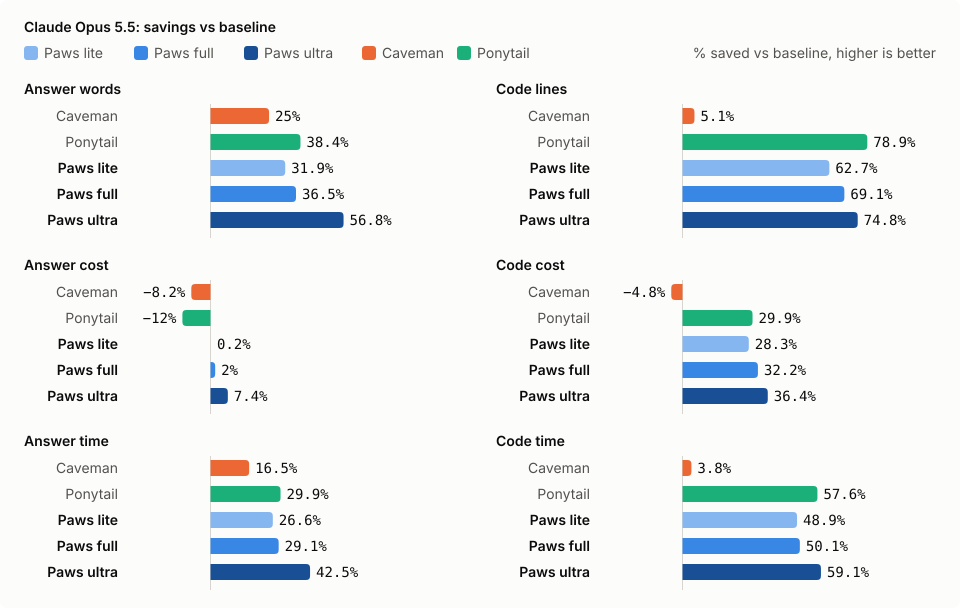
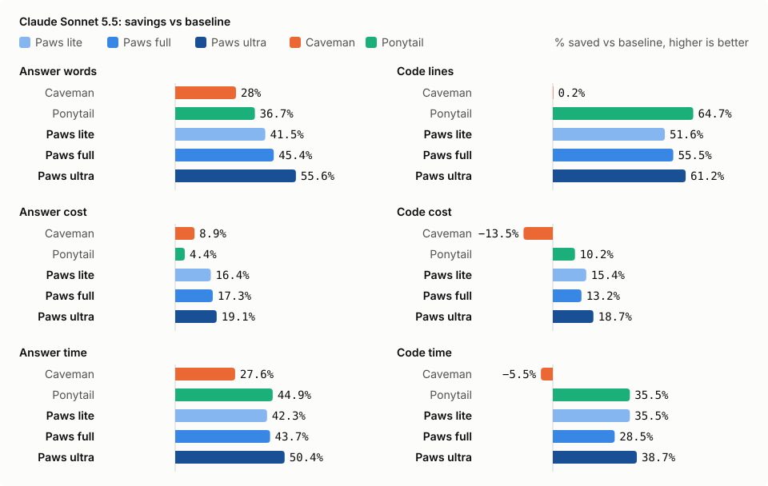
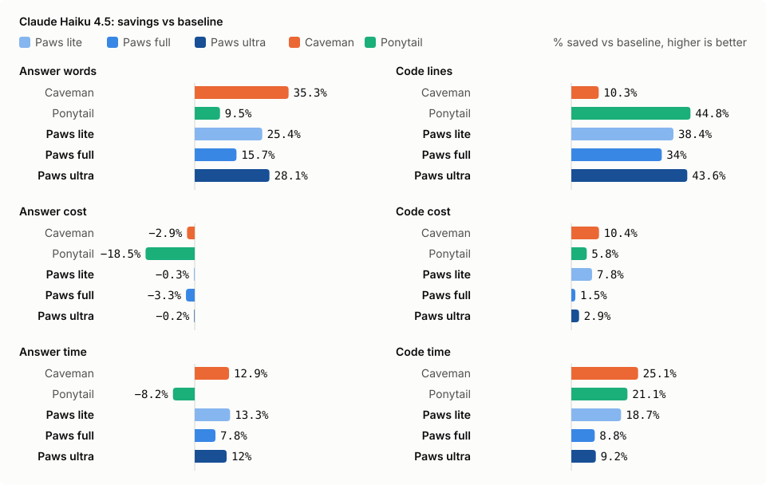

# Paws


A short instruction set that makes coding agents (Claude Code, Codex) write less code and use fewer
tokens, while keeping safeguards and still answering properly.

Paws is inspired by two projects:
- [Caveman](https://github.com/juliusbrussee/caveman) cuts how much the agent *says*: compressed,
  filler-free replies.
- [Ponytail](https://github.com/DietrichGebert/ponytail) cuts how much the agent *builds*: the
  simplest solution that works, stdlib first, no unrequested abstractions.

Each is strong on one side: Caveman on prose, Ponytail on code. Paws takes the core idea of both and
balances them, so coding tasks and non-code answers both get shorter. It also adds rules for reading
less, fixing bugs at the root, and testing only what changed. C# and TypeScript rules sit in separate
skills that load only when needed.

> Paws was tuned and generated with AI ([Claude](https://claude.com/claude-code)). See [Credits](#credits).

## How Paws compares

### Features

| | Baseline | Caveman | Ponytail | **Paws** |
|---|:---:|:---:|:---:|:---:|
| Terse replies (answer first, no filler) | – | ✓✓ | ✓ | ✓ |
| Compressed wording (fragments, short words) | – | ✓✓ | – | ✓ |
| Build only what's asked | – | – | ✓✓ | ✓ |
| Reuse project code, stdlib, native features | – | – | ✓ | ✓ |
| Root-cause bug fixes (check sibling callers) | – | – | ✓ | ✓ |
| Safeguards kept (validation, security, error handling) | – | – | ✓ | ✓ |
| Read only needed files, batch tool calls | – | – | – | ✓ |
| Test only changed code, once after the last step | – | – | – | ✓ |
| Ask-or-assume rule (defaults for vague requests) | – | – | partial | ✓ |
| Language skills (C#, TypeScript), loaded on demand | – | – | – | ✓ |
| Intensity modes and switch commands | – | ✓ | ✓ | ✓ (lite, full, ultra, off) |
| Plain-language security warnings | – | ✓ | – | – |
| Size (words) | 0 | 491 | 1,079 | 407 core + ~65 per skill |

✓✓ marks the project's main strength.

### Measured results

All runs go through the Claude Code CLI. Numbers are savings against baseline (no instruction), as
per-run averages; a − means the arm used more than baseline. Best value per row in bold. Answers come
first, then code. Paws uses its C#/TypeScript skills on code tasks.

**Claude Opus 5.5** (1 run per cell, `bench/results/2026-10-03-opus55-reference.json`)

<picture>
  <source media="(prefers-color-scheme: dark)" srcset="docs/charts/opus55-dark.svg">
  
</picture>

| | Caveman | Ponytail | Paws lite | Paws full | Paws ultra |
|---|---:|---:|---:|---:|---:|
| Answers, 10 non-code tasks (words) | 25% | 38.4% | 31.9% | 36.5% | **56.8%** |
| Answers cost | −8.2% | −12% | 0.2% | 2% | **7.4%** |
| Answers time | 16.5% | 29.9% | 26.6% | 29.1% | **42.5%** |
| Code, 12 C#/TypeScript tasks (lines) | 5.1% | **78.9%** | 62.7% | 69.1% | 74.8% |
| Code cost | −4.8% | 29.9% | 28.3% | 32.2% | **36.4%** |
| Code time | 3.8% | 57.6% | 48.9% | 50.1% | **59.1%** |
| Correct | 22/22 | 22/22 | 22/22 | 22/22 | 21/22 |

On `ts-hooks`, Paws ultra said it wrote `hooks.ts` but no file was written, so it scores 21/22 and its
code-lines saving is slightly flattered.

**Claude Sonnet 5.5** (1 run per cell, `bench/results/2026-10-02-sonnet55-reference.md`)

<picture>
  <source media="(prefers-color-scheme: dark)" srcset="docs/charts/sonnet55-dark.svg">
  
</picture>

| | Caveman | Ponytail | Paws lite | Paws full | Paws ultra |
|---|---:|---:|---:|---:|---:|
| Answers, 10 non-code tasks (words) | 28% | 36.7% | 41.5% | 45.4% | **55.6%** |
| Answers cost | 8.9% | 4.4% | 16.4% | 17.3% | **19.1%** |
| Answers time | 27.6% | 44.9% | 42.3% | 43.7% | **50.4%** |
| Code, 12 C#/TypeScript tasks (lines) | 0.2% | **64.7%** | 51.6% | 55.5% | 61.2% |
| Code cost | −13.5% | 10.2% | 15.4% | 13.2% | **18.7%** |
| Code time | −5.5% | 35.5% | 35.5% | 28.5% | **38.7%** |
| Correct | 22/22 | 22/22 | 22/22 | 22/22 | 22/22 |

**Claude Haiku 4.5** (Paws modes 2 runs, baseline code 3 runs, Caveman and Ponytail 1 run)

<picture>
  <source media="(prefers-color-scheme: dark)" srcset="docs/charts/haiku45-dark.svg">
  
</picture>

| | Caveman | Ponytail | Paws lite | Paws full | Paws ultra |
|---|---:|---:|---:|---:|---:|
| Answers, 10 non-code tasks (words) | **35.3%** | 9.5% | 25.4% | 15.7% | 28.1% |
| Answers cost | −2.9% | −18.5% | −0.3% | −3.3% | **−0.2%** |
| Answers time | 12.9% | −8.2% | **13.3%** | 7.8% | 12% |
| Code, 12 C#/TypeScript tasks (lines) | 10.3% | **44.8%** | 38.4% | 34% | 43.6% |
| Code cost | **10.4%** | 5.8% | 7.8% | 1.5% | 2.9% |
| Code time | **25.1%** | 21.1% | 18.7% | 8.8% | 9.2% |
| Correct | 22/22 | 21/22 | 44/44 | 44/44 | 44/44 |

**Target:** Paws aims for 50–70% of Caveman's and Ponytail's savings added together. On Opus that's
31.7–44.4% for answers and 42–58.8% for code, and every Paws mode meets or beats both. On Sonnet that's
32.5–45.5% for both code and answers, and every Paws mode is inside or above it. On Haiku the range is
27.5–38.5% for code and 22–31% for answers. Ultra and lite meet both. Full meets code only.

- Savings grow with the model, because bigger models' baselines write more (lines and words: Opus 1,821
  and 5,077, Sonnet 1,442 and 3,569, Haiku 1,094 and 2,276), so there's more to trim.
- On Haiku, answers cost about the same as baseline or more for every arm: these replies are short and
  cheap, so the instruction's own input tokens outweigh the words saved.
- These are 1–3 runs per cell, so treat gaps under about 5 points as noise. On Haiku, full and lite
  swapped places between runs.

### Advantages and disadvantages

**Baseline (no instruction)**
- \+ Full explanations, more tests written by default
- − Longest code and answers, highest cost and time, over-builds on open-ended requests

**Caveman**
- \+ Short non-code answers (28% to 35%), simple to understand
- \+ Modes from light to extreme, plain language kept for security warnings
- − Doesn't shrink code (0% to 10%), and costs 13% more than baseline on Sonnet code tasks
- − No rules for scope, safeguards or tests

**Ponytail**
- \+ Smallest code (45% to 65%), strong scope discipline, explicit safeguards
- − Answer savings depend on the model (9% on Haiku, 37% on Sonnet)
- − Longest prompt (1,079 words), so smaller code doesn't turn into equal cost savings

**Paws**
- \+ Balanced: strong savings on both code and answers. Ultra comes within 4 points of Ponytail on code
  on both models, and gives the shortest answers on Sonnet
- \+ Cheapest and fastest arm on Opus and Sonnet (ultra on Opus saves 36% code cost and 43–59% time)
- \+ Modes (lite, full, ultra, off) that persist across sessions in plugin installs
- \+ Adds read-less, root-cause and test-once rules, with safeguards spelled out
- \+ One source for Claude Code and Codex, installable as a plugin, skills, or copy-paste
- − Ponytail still writes slightly less code. Caveman's answers are shorter on Haiku
- − The C#/TypeScript gain depends on the skills loading. The core alone saved only 14% on Haiku code
- − Ultra prose uses fragments and abbreviations, which some readers find harder to follow
- − Codex packaging follows Codex's docs and Ponytail's layout, but hasn't been tested live yet

**Shared blind spot:** none of the four reliably fixes a bug that also lives in a sibling function
(`trace-transfer` task, Haiku: 0–1 passes out of 3 for every arm).

### Modes

| Mode | What it does | Use when |
|---|---|---|
| lite | Answer first, no filler, safeguards and test rules. Full sentences, normal code scope | You want readable output with solid savings |
| full | All rules (default) | Everyday use |
| ultra | Full plus fragment prose with abbreviations, ≤3-bullet explanations, smallest version | Maximum savings |
| off | Paws disabled | Normal agent |

Switch by saying `paws lite`, `paws full`, `paws ultra` or `stop paws`, or with `/paws:paws ultra`
(Claude) or `$paws ultra` (Codex). In plugin installs the choice is saved to `~/.paws/mode` and
kept for new sessions. In copy-paste installs it lasts for the conversation.

## Install

| Way | Claude Code | Codex |
|---|---|---|
| Plugin (recommended) | `claude plugin marketplace add krurkrit/paws`, then `claude plugin install paws@paws` | `codex plugin marketplace add krurkrit/paws`, then `codex plugin add paws@paws`, review `/hooks` |
| Skills only | copy `skills/*` to `~/.claude/skills/` | copy `skills/*` to `~/.agents/skills/` |
| Copy-paste | paste `dist/paws.md` into `~/.claude/CLAUDE.md` or a project `CLAUDE.md` | paste into `~/.codex/AGENTS.md` or a project `AGENTS.md` |
| One project | `python scripts/build.py --install <project>` (writes both files, never overwrites without `--force`) | same |

The plugin's start-up hook injects the core every session. The language skills load only for C#/.NET
or TypeScript/React work. A skills-only install loads the core on demand, so use the plugin or
copy-paste to keep the rules always on. To try the plugin without installing it, run
`claude --plugin-dir <path-to-repo>`.

## Repo layout

```
src/paws.md                 core rules: the only file to edit (plus src/skills/*)
skills/                     generated: paws (core), paws-csharp, paws-typescript
dist/paws.md                generated: plain text for any custom-instruction box
dist/claude/CLAUDE.md       generated: project/user file for Claude Code
dist/codex/AGENTS.md        generated: project/user file for Codex
.claude-plugin/             Claude plugin + marketplace manifests
.codex-plugin/, .agents/    Codex plugin + marketplace manifests
hooks/                      SessionStart hook: keeps the core always on in plugin installs
scripts/build.py            src -> skills/ + dist/, --check, --install DIR
scripts/charts.py           README charts (docs/charts/) from bench/results/
bench/                      benchmark (see bench/README.md)
```

## Benchmark it

```bash
python bench/runners/claude.py --selftest
python bench/runners/claude.py --task cs-repo,ts-emitter --arms baseline,paws,paws+skills --models haiku --runs 3
python bench/runners/codex.py  --task safe-path --arms baseline,paws
```

An arm name is the file stem of `src/paws.md` or `bench/instructions/*.md`. `paws-lite` and `paws-ultra`
set a mode, and a `+skills` suffix (for example `paws-ultra+skills`) adds the language skills when a task
matches them. Models: `haiku`, `sonnet55` (`--models`). Needs the `claude` and/or `codex` CLI on PATH. Reference
numbers are in `bench/results/`.

## Change Paws

Change one rule at a time:
1. Edit `src/paws.md` (or `src/skills/*`).
2. Run `python scripts/build.py`.
3. Rerun the fixed task set and compare with `bench/results/`.
4. Keep the change only if code size, answer length, pass rate and cost don't get worse.
5. After saving new reference results, run `python scripts/charts.py` to redraw the README charts.

## Credits

Paws builds on ideas from [Caveman](https://github.com/juliusbrussee/caveman) by Julius Brussee and
[Ponytail](https://github.com/DietrichGebert/ponytail) by Dietrich Gebert. The agentic benchmark is
adapted from Ponytail's.

Paws was written, tuned and benchmarked with [Claude](https://claude.com/claude-code) (Claude Code).
Claude drafted the instruction and skills, built the plugin, ran the benchmarks and wrote this README,
with a person directing the goals and reviewing each change.
